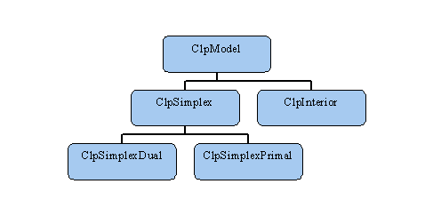

Basic Model Classes
===================

Hierarchy
=========

The basic CLP model class hierarchy is simple. The top three levels of
the hierarchy are depicted in the figure below. The first two levels
(i.e. `ClpModel`, `ClpSimplex`, `ClpInterior`) contain all the problem
data which define a model (that is, a problem instance). The third level
contains most of the algorithmic aspects of CLP. There is a fourth level
(for models with more general objectives than linear ones), but a
description of it is beyond the current scope of this document.



Most Simplex users need only concern themselves with the classes
`ClpModel` and `ClpSimplex`. There are algorithm-specific classes which
inherit from `ClpSimplex` (e.g. `ClpSimplexDual` and
`ClpSimplexPrimal`), but they have no member data and rarely need be
visible to the user. These classes are cast at algorithm time. So, for
example, after instantiating an object `model` of type `ClpSimplex`, a
user only need call `model.dual()` to invoke the dual simplex method.

First Example
=============

Below is our first CLP sample program. It is short enough to present in
full (this code can be found in the CLP Samples directory, see
[here](./moresamples)). Most of the remaining examples in this Guide will
take the form of small code fragments.

```
// Copyright (C) 2002, International Business Machines
// Corporation and others.  All Rights Reserved.

#include "ClpSimplex.hpp"
int main (int argc, const char *argv[])
{
  ClpSimplex  model;
  int status;
  if (argc<2)
    status=model.readMps("../../Mps/Sample/p0033.mps");
  else
    status=model.readMps(argv[1]);
  if (!status) {
    model.primal();
  }
  return 0;
}
```

This sample program creates a `ClpSimplex` model, reads an MPS file, and
if there are no errors, solves it using the primal algorithm. The
program is easy to follow, but it is not terribly useful: it does not
attempt to inspect the results of the solve. There are two main kinds of
results: a "status" describing what happened to the model during the
solve, and arrays filled with solution values. Both will be addressed in
this chapter.

Getting at the Solution
=======================

It is often the case with CLP that there is more than one way to do
something. This is a consequence of CLP's mixed heritage as a child of
[OSL](http://www-306.ibm.com/software/data/bi/osl/) and a cousin of
[OSI](http://www.github.com/coin-or/OSI). Finding the status of a
model exemplifies this situation.

The OSI way to check for optimality is to call `model.isProvenOptimal()`.
Also available are `isProvenPrimalInfeasible()`,
`isProvenDualInfeasible()`, `isPrimalObjectiveLimitReached()`,
`isDualObjectiveLimitReached()`, `isIterationLimitReached()` or the
feared `isAbandoned()`. Should one prefer the OSL way of doing things,
model.status() returns as it would in OSL, so 0 means optimal, 1 means
primal infeasible etc.

Similarly, to pick up the solution values, one could inhabit the
virtuous world of OSI, or the not-quite-so-virtuous world of OSL and
"pure" CLP. By this it is meant that const and non-const forms of
arrays are used, respectively. It is easier to deal with the non-const
versions, so most of the elaborate algorithms in CLP and its
[Samples](./moresamples) use them.

Methods for getting solution information:

|Purpose                    | OSI-style (virtuous)               | CLP-style (less virtuous) |
|---------------------------|------------------------------------|-----------------------------------|
|Primal column solution     | `const double * getColSolution()`  | `double * primalColumnSolution()` |
|Dual row solution          | `const double * getRowPrice()`     | `double * dualColumnSolution()`   |
|Primal row solution        | `const double * getRowActivity()`  | `double * primalRowSolution()`    |
|Dual row solution          | `const double * getReducedCost()`  | `double * dualColumnSolution()`   |
|Number of rows in model    | `int getNumRows()`                 | `int numberRows()`                |
|Number of columns in model | `int getNumCols()`                 | `int numberColumns()`             |

The reader may have noted a preference for "number" over "num" and
"column" over "col". This may be a reaction to when one of the
authors was young and 5 or 6 letters was the maximum in FORTRAN for any
name or to early days with OSL when seven characters were allowed but
the first three had to be "ekk"!

Using the above-listed functions, our initial example
might be continued as follows:
```
int numberRows = model.numberRows();
double * rowPrimal = model.primalRowSolution();
double * rowDual = model.dualRowSolution();

int iRow;

for (iRow=0;iRow<numberRows;iRow++)
  printf("Row %d, primal %g, dual %g\n",iRow,rowPrimal[iRow],rowDual[iRow]);

int numberColumns = model.numberColumns();
double * columnPrimal = model.primalColumnSolution();
double * columnDual = model.dualColumnSolution();

int iColumn;

for (iColumn=0;iColumn<numberColumns;iColumn++)
  printf("Column %d, primal %g, dual %g\n",iColumn,
  columnPrimal[iColumn],columnDual[iColumn]);
```

This code sample would pretty-print information about the model's
primal and dual solutions. How to additionally print row and column
names is illustrated in the `defaults.cpp` file in the "Samples"
directory (the Samples are properly addressed [here](./moresamples)).
This sample is also useful as it explicitly performs default actions
(e.g. it sets the primal feasiblility tolerance value to the default
value).

The remainder of this chapter will show more of the basic CLP tasks a
user might wish to perform. Apart from presolve we will only be looking
at actions which can be performed when including the single header file
`ClpSimplex.hpp`.

Building and Modifying a Model
==============================

Rather than reading a model from an MPS file we can load a model from
arrays in memory. There are various `loadProblem` methods which are
similar to those in OSI. It is easy to add more such methods to CLP if
the need arises.

We can copy in integer information by
`copyInIntegerInformation(const char * array)` where array is 0 or 1 to
say integer and we can drop existing information by
`deleteIntegerInformation()`. There are various ways of changing the
size of a model. The simplest is by the use of the method
`resize(newNumberRows,newNumberColumns)` - this will either truncate the
model or add "default" rows or columns - a default row has lower bound
of -infinity and upper bound of +infinity, while a default column has
zero cost, zero lower bound and an upper bound of +infinity.

Normally we would use `deleteRows`, `addRows`, `deleteColumns` and
`addColumns`, where the `add` methods will also add in the elements. A
potentially very useful way of modifying a model is strictly a
constructor. Given a large model and a list of rows and a list of
columns it constructs the model as a subset of the large model. It is
possible to change the order of the columns/rows and to duplicate
columns/rows. So a list of columns 4,4,1,0 will create a new model where
the first two columns are copies of column 4 in original model and the
next two are the first two of original model in reverse order. This can
be useful to form a model with piecewise linear costs by duplicating
columns and then modifying bounds and costs.

Tolerances
==========

There are set and get methods for tolerances, for example,
`double primalTolerance()` and `setPrimalTolerance(double)`. Assuming
that one has a minimization problem, an individual variable is deemed
primal feasible if it is less than the tolerance referred to by these
methods below its lower bound and less than it above its upper bound.
Similarly for dual tolerances, a variable is deemed to be dual feasible
if its reduced cost is greater than minus the tolerance or its distance
to the upper bound is less than primal tolerance and the reduced cost is
less than plus the tolerance or the distance to lower bound is less than
primal tolerance. In short, this is complementarity conditions adadpted
for tolerances and simple lower and upper bounds.(Note that the above
was stated as for minimization; signs are reversed for maximization.)

Some Useful Set and Get Methods
===============================

| Method(s)                                                                                                                                                                                                                 | Description |
|---------------------------------------------------------------------------------------------------------------------------------------------------------------------------------------------------------------------------|--------------------------------------------------------------------------------------------------------------------------------------------------------------------------------------------------------------------------------------------------------------------------------------- |
| `setMaximumIterations(int value)` `int maximumIterations()` `setMaximumSeconds(double value)` `double maximumIterations()`                                                                                                | These methods tell CLP to stop after a given number of iterations or seconds (and returns these values). |
| `double objectiveValue()`                                                                                                                                                                                                 | This method returns the objective value. |
| `const double * getObjCoefficients()` `double * objective()`                                                                                                                                                              | These methods return the objective coefficients. |
| `const double * getRowLower()` `double * rowLower()` `const double * getRowUpper()` `double * rowUpper()` `const double * getColLower()` `double * columnLower()` `const double * getColUpper()` `double * columnUpper()` | These methods give lower and upper bounds on row and column activities. |
| `double * infeasibilityRay()` `double * unboundedRay()`                                                                                                                                                                   | If the problem was primal or dual infeasible, these methods will give a pointer to a ray proving infeasibility. |
| `CoinPackMatrix * matrix()`                                                                                                                                                                                               | There are more options as the user has great flexibility in how the problem matrix is stored, but the default matrix class is `CoinPackedMatrix` (see Matrix Classes [here](./notsobasic)). So we have that this method returns a pointer to a `CoinPackedMatrix` which can be further manipulated. |
| `CoinBigIndex getNumElements()`                                                                                                                                                                                           | Returns the number of elements in the problem matrix. `CoinBigIndex` is a `typedef` which in most cases is the same as `int`. |
| `void setOptimizationDirection(double value)` `double optimizationDirection()`                                                                                                                                            | These methods set and get the objective sense. The parameter `value` should be +1 to minimize, -1 to maximize, and 0 to ignore. |

Simplex-specific Methods
========================

Some of the most commonly-used methods when working with Simplex are
listed in the following table:

| Method(s)                                                          | Description
| -------------------------------------------------------------------|---------------------------------------------------------------------------------------------------------------------------------------------------------------------------------------------------------------------------------------------------------------------------------------------------------------------------------------------------------------------------------------------------------------------------------------------------------------------------------------------
| `primal(int mode=0)`                                               | This applies the primal algorithm. If `mode` is set to the default of 0, then the method uses the status variables to determine basis and solution. If `mode` is 1 then the method does a values pass so variables not in basis are given their current values and one pass of variables is done to clean up the basis with an equal or better objective value.
| `dual(int mode=0)`                                                 | This applies the dual algorithm. if `mode` is set to the default of 0, then the method uses the status variables to determine basis and solution. If `mode` is 1 then the method uses input duals and does a values pass so one pass of basic variables is done to clean up the duals with an equal or better objective value.
| `scaling(int mode=1)`                                              | This method toggles scaling on (`mode` set to 1) and off (`mode` set to 0).
| `int crash(double gap,int mode)`                                   | This method attemps to improve on an all slack basis. For dual this will move variables to the dual feasible bound if the gap between bounds is less than `gap`. Setting `mode` to 0 guesses which algorithm is better, while a value of 1 or 2 will result in more work being done. The return code is 0 if the basis was not slacks in first case, it is negative if dual is preferred or positive if primal. ±1 means an all slack basis seemed best, while ±2 means some work was done.
| `perturb(int mode)`                                                | This method toggles perturbation on (`mode` set to 1) and off (`mode` set to 0). It should be considered a work in progress, although on some problems it gives very good results.
| `factorizationFrequency()` `setFactorizationFrequency(int value)`  | These are "get" and "set" methods for the basis matrix factorization frequency. The default is to refactor every 200 iterations, but it may make more sense to use something such as 100 + the number of rows divided by 50.
| `dualBound()` `setDualBound(double value)`                         | These are "get" and "set" methods for the "dual bound". The CLP dual algorithm declares all problems to be dual feasible by putting non-basic variables to correct bounds for the reduced cost. If the gap between the bounds is too big then it pretends the gap is only the value specified by this set method. In essence, this gives a composite dual rather than a pure Phase I- Phase II method.
| `infeasibilityCost()` `setInfeasibilityCost(double value)`         | These are the primal analogs to the "dual bound" methods.
| `numberPrimalInfeasibilities()` `sumPrimalInfeasibilities()`       | After a solve, there may be infeasibilities. These methods serve to check for said infeasibilities. One could check the solution explicitly as well. For a code fragement illustrating this, see the following example. |

Presolve
========

The header file for the use of CLP's presolve functionality is
`Presolve.hpp`. The sample program below illustrates
some of the possibilities offered by CLP's presolve:
```
#include "ClpSimplex.hpp"
#include "ClpPresolve.hpp"

int main (int argc, const char *argv[])
{
  ClpSimplex model;
  model.readMps("../../Data/Sample/p0033.mps"); // initialized by readMps or whatever
  ClpPresolve presolveInfo;
  ClpSimplex * presolvedModel = presolveInfo.presolvedModel(model);
  // at this point we have original model and a new model.  The  information
  // on the operations done is in presolveInfo
  if (presolvedModel) {
    // was not found to be infeasible - so lets solve
    // if presolvedModel was NULL then it was primal infeasible and ...
    presolvedModel->dual(); // or whatever else we wish to do
    presolveInfo.postsolve(true);  // the true updates status arrays in original
    /* If the presolved model was optimal then so should the original be.
       We can use checkSolution and test feasibility */
    model.checkSolution();
    if (model.numberDualInfeasibilities()|| model.numberPrimalInfeasibilities())
      printf("%g dual %g(%d) Primal %g(%d)\n",
        model.objectiveValue(),
        model.sumDualInfeasibilities(),
        model.numberDualInfeasibilities(),
        model.sumPrimalInfeasibilities(),
        model.numberPrimalInfeasibilities());
    // Due to tolerances we can not guarantee that so you may wish to throw in
    model.primal(1);
  }
}
```

Presolve has a few more options which can be found in the header file,
for example whether to treat as an integer problem or whether to keep
row and column names.

Status Array
============

The astute reader may have noticed that the status array has been
mentioned once or twice. The beginning user will not need to look at it
Nevertheless, for completeness the status of a variable can be found and
set as shown below. The possible state of a variable are listed in the
following table (each may have to be preceded by `ClpSimplex::`):

| Status          | Description |
|-----------------|--------------------------------------- |
| `basic`         | In basis |
| `isFree`        | Not in basis, has infinite bounds |
| `isFixed`       | Not in basis, bounds are equal |
| `atUpperBound`  | At upper bound, not in basis |
| `atLowerBound`  | At lower bound, not in basis |
| `superBasic`    | Between bounds, but not basic or free |

To get or set the status of a variable is a simple task:
```
// Get row status...
Status status=model.getRowStatus(sequenceNumber)
// ... or get column status.
Status status=model.getColumnStatus(sequenceNumber)
// Set row status to basic (for example)...
model.setRowStatus(sequenceNumber,ClpSimplex::basic)
// ... or column status to basic.
model.setColumnStatus(sequenceNumber,ClpSimplex::basic)
```
