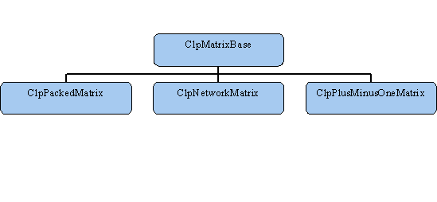

Not-Quite-So-Basic Model Classes {#notsobasic}
================================

Pivot Choices {#pivotchoices}
=============

In the dual algorithm, any infeasible basic variable may be chosen to
leave the basis. Similarly in the primal algorithm, any non-basic
variable with a \"bad\" reduced cost may be chosen to enter the basis.
This choice is probably the most important factor in determining the
number of iterations it will take to solve a problem. Clp provides a
abstract base class for each case and then instances of each. It is
relatively simple for an advanced user to create new instances.

For the dual method the base class is `ClpDualRowPivot`. The two
existing instances are `ClpDualRowDantzig` and `ClpDualRowSteepest`. The
Dantzig version implements the \"standard\" pivot rule: choose the most
violated basic variable. It is easily dominated by the Steepest instance
which should normally be used. The default is to use un-initialized
weights where the initial weight for each basic variable is 1.0. If an
all-slack basis is being used then these are the correct weights. To use
a version which calculates the weights, create an instance and pass it
to ClpSimplex model as in the following code fragment:

      ClpDualRowSteepest steep(1); // 0 uninitialized, 1 compute weights
      model.setDualRowPivotAlgorithm(steep);
      

Similarly for the primal method the base class is
`ClpPrimalColumnPivot`. The two existing instances are
`ClpPrimalColumnDantzig` and `ClpPrimalColumnSteepest`. The Dantzig
version implements \"standard\" pivot rule: choose the most \"violated\"
non-basic variable. It is dominated by the Steepest instance which
should normally be used. The default is to use exact Devex where the
initial weight for each non-basic variable is 1.0. Unlike for the dual,
this is never the same as normal steepest edge. To use a version which
does steepest edge create an instance and pass it to ClpSimplex model as
in the following code fragment:

      ClpPrimalColumnSteepest steep(1); // 0 devex, 1 steepest
      model.setPrimalColumnPivotAlgorithm(steep);
      

The partial pricing scheme (for long, thin problems) currently does not
exist. This could be implemented by anyone who is interested.

Matrix Classes {#matrixclasses}
==============

The next abstract class of interest is `ClpMatrixBase`. CLP encapsulates
its knowledge of how a matrix is stored in this class. The default
instance of this is the `ClpPackedMatrix` class. This is identical in
format to `CoinPackedMatrix`. Below is a diagram summarizing the
hierarchy of the most important matrix classes:

The important new methods implemented are for filling a basis, checking
validity of elements and faster \"times\" and \"transposeTimes\" when
the input array is sparse and/or we have a row copy of the matrix.
Advanced users should note that not all methods have to be implemented.
In particular, `scaling` need not be implemented and
`reverseOrderedCopy` can return `NULL` if a row copy does not make
sense.

In addition to the default class, there are two others at present:
`ClpPlusMinusOneMatrix` and `ClpNetworkMatrix`. As the name implies, the
first one is useful when all elements are ±1. In this case multiplies
are not needed and more importantly less memory is used and there are
fewer cache misses. A class for a matrix where all elements are +1 would
be trivial to create. If there were fewer than 64000 rows one could even
store row indices as shorts etc.

The use of `ClpPlusMinusOneMatrix` involves some work as one cannot
simply read-in an MPS file. The key is to use `loadProblem` to pass in a
matrix. So if `matrix` was a `CoinPackedMatrix` one could do the
following:

      ClpPlusMinusOneMatrix plusMinus(matrix);
      assert (plusMinus.getIndices()); // would be zero if not +- one
      model.loadProblem(plusMinus,
        lowerColumn,upperColumn,objective,
        lower,upper);
      

`ClpNetworkMatrix` is similar, but represents a network, thus may only
have one element per column. Fortunately, using is is very easy. Given
`head` and `tail`, one could do the following:

      ClpNetworkMatrix network(numberColumns,head,tail);
      model.loadProblem(network,
        lowerColumn,upperColumn,objective,
        lower,upper);
      

Actual code is in `COIN/Clp/Test/unitTest.cpp`. A quick glance at the
output of this program shows that use of `ClpNetworkMatrix` gives much
faster run times. This is not because of storage issues, but because CLP
recognizes the network and uses a network basis factorization which is
much faster. However, in this mode CLP is not a genuine network code as
it does not take full advantage of the structure by combining operations
but it does have the advantage of flexibility.

Other instances are possible. In particular, it should be possible to
use the abstract class for column generation or for dynamic matrices
which change over time. Minor modifications may be needed but it should
work quite smoothly (there is already a dummy \"refresh\" method which
would be used).

Message Handling {#messagehandling}
================

Strictly speaking, message handling is a general COIN topic, but it
won\'t hurt to repeat a few important things here.

A simple user you may wish to turn off some output. This is done with
`model.setLogLevel(int value)` where 0 gives nothing and each increase
in value switches on more messages. See `ClpMessage.cpp`,
`CoinMessage.cpp` and [???](#messages) to see which messages are at
which level. A more sophisticated user may wish to handle messages in a
different way. This is done using `passInMessageHandler` with a pointer
to a handler of the user\'s own design. The simplest case would be to
use the default handler but use a constructor which writes to file. The
code would be:

      FILE * fp; // assumed open
      CoinMessageHandler handler(fp);
      model.passInMessageHandler(&handler);
      

A still more sophisticated use would be to write a class derived from
`CoinMessageHandler` and then override the `print` method. Below follows
an example which would print only a message for optimality (or
infeasibility):

      class DerivedHandler :
       public CoinMessageHandler {
       public:
         virtual int print() ;
       };

       int DerivedHandler::print()
       {
         if (currentSource()=="Clp") {
           if (currentMessage().externalNumber()>=0
           && currentMessage().externalNumber()<4) { 
             // finished
             return CoinMessageHandler::print(); // print
           }
         }
         return 0;
       }
      
